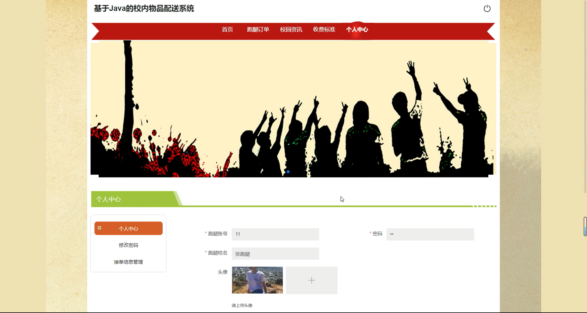

# springbootA435D
springbootA435D校内物品配送系统+LW
 
## 查看主页获取源码

### 一、关键词
跑腿信息管理、跑腿接单信息、跑腿校园资讯

### 二、作品包含
源码+数据库+设计文档万字+全套环境和工具资源+本地部署教程

### 三、项目技术
前端技术：Html、Css、Js、Vue3.0、Element-plus 
后端技术：Java、SpringBoot3.0、MyBatis

### 四、运行环境（以下版本亲测，其他版本未知，请自测）
开发工具：IDEA/eclipse  + VSCODE

数据库：MySQL5.7（最低要5.7版本）

数据库管理工具：Navicat10以上版本

环境配置软件： JDK17 + Maven3.6.3

前端Nodejs：20

浏览器：谷歌浏览器

### 五、项目介绍
项目编号：springbootA435D

校内物品配送系统主要用于为校内师生提供便捷的物品传递服务等功能，解决校园内物品传递需求。

角色：管理员、用户、跑腿

管理员：首页、管理员管理、用户管理、跑腿信息管理、接单信息管理、校园资讯管理、收费标准管理、操作日志管理。

用户：首页、跑腿信息管理、接单信息管理。

跑腿：首页、跑腿订单、校园资讯、收费标准、个人中心、修改密码、接单信息管理。

### 六、运行截图

